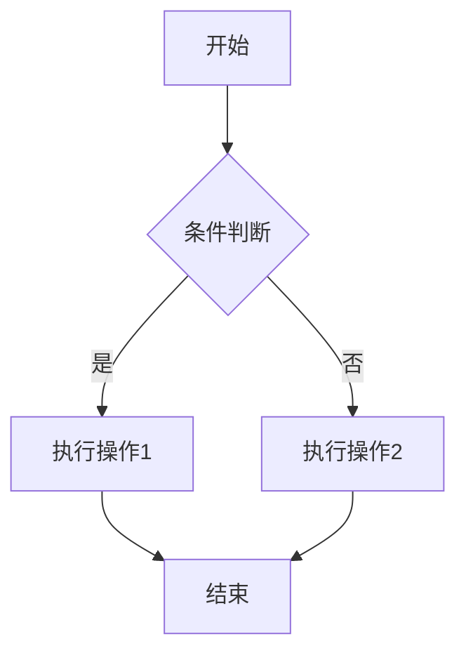
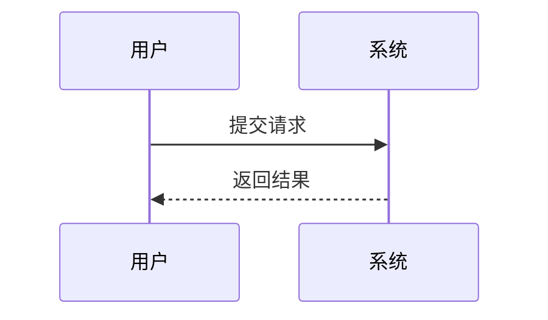
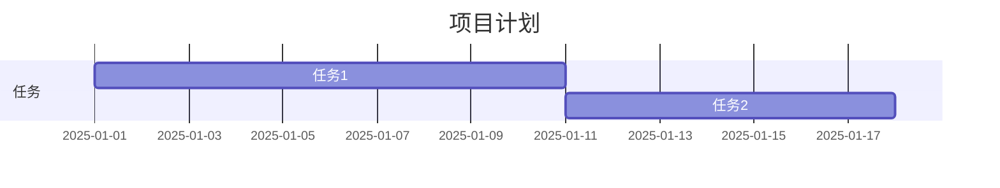
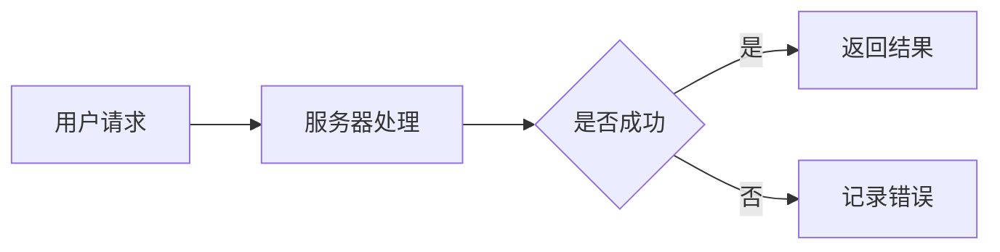

# Mermaid语法与示例详解

在现代的技术文档和博客中，使用图表来表达复杂的逻辑和流程变得越来越普遍。Mermaid 是一种功能强大的工具，能够通过简单的标记语言快速生成流程图、时序图、甘特图等多种图表类型。本文将带您了解 Mermaid 的基本语法，并通过示例帮助您快速上手。

## 什么是 Mermaid？

Mermaid 是一种基于 JavaScript 的图表生成工具，支持在 Markdown 文件中直接嵌入代码块生成图表。它的核心优势在于：
- 语法简单，易于学习。
- 支持多种图表类型，包括流程图、时序图、甘特图、类图等。
- 可与许多文档工具（如 GitHub、Hexo 等）无缝集成。

## Mermaid 的基本语法

Mermaid 的语法通常以 `graph`、`sequenceDiagram` 等关键词开头，后续内容则定义图表的具体结构。以下是常用图表类型的语法示例：

### 1. 流程图（Flowchart）

流程图是 Mermaid 最常用的图表类型之一，用于描述流程或算法的执行顺序。

**语法说明：**
- `graph TD` 表示图表方向为从上到下（Top to Down）。
- 方括号 `[]` 表示矩形节点，花括号 `{}` 表示菱形节点（通常用于条件判断）。
- `-->` 表示节点之间的连接关系，`|是|` 和 `|否|` 是连接线上的标签。

### 2. 时序图（Sequence Diagram）

时序图用于描述多个参与者之间的交互顺序。

**语法说明：**
- `participant` 定义参与者。
- `->>` 表示消息的发送方向，`-->>` 表示返回消息。

### 3. 甘特图（Gantt Chart）

甘特图用于展示项目的时间规划。

**语法说明：**
- `title` 定义图表标题。
- `dateFormat` 定义日期格式。
- 每个任务可以指定开始时间、持续时间或依赖关系。

## 如何使用 Mermaid？

1. **在 Markdown 文件中嵌入 Mermaid：**  
   如果您的博客平台支持 Mermaid（如 Hexo、GitHub Pages 等），只需在代码块中以 `mermaid` 开头即可。

2. **使用在线工具：**  
   您可以使用 [Mermaid Live Editor](https://mermaid-js.github.io/mermaid-live-editor/) 在线编辑和预览 Mermaid 图表。

## 示例代码

以下是一个综合示例，展示如何结合多个 Mermaid 图表类型：

**效果预览：**
- 用户请求经过服务器处理后，根据处理结果返回不同的响应。

## 参考资料

如果您想进一步了解 Mermaid 的语法和功能，可以参考以下资源：
- [Mermaid 官方文档](https://mermaid-js.github.io/mermaid/#/)
- [Mermaid Live Editor](https://mermaid-js.github.io/mermaid-live-editor/)

Mermaid 的强大之处在于其简单直观的语法和灵活的图表生成能力，希望本文能够帮助您快速上手，并在您的文档或博客中创造更丰富的内容！