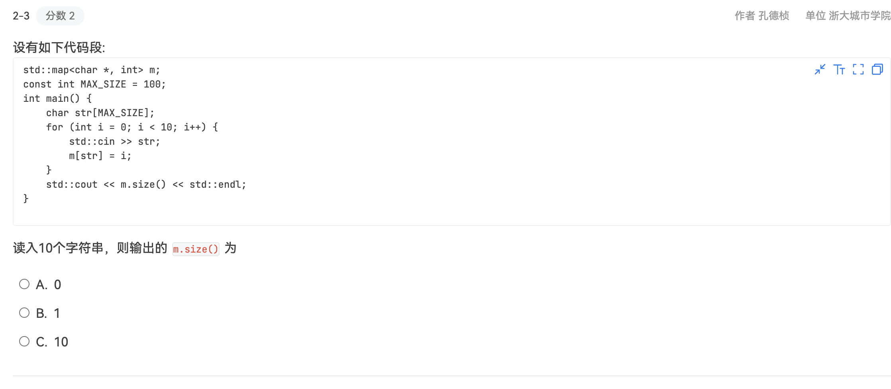
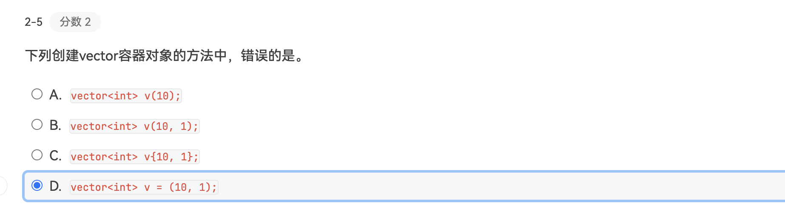

编译时, 从`c`的`gcc`转变为了`g++`.

OOP的三大特点:

- 封装
- 继承
- 多态

# 基本语法
在C语言中,我们主要使用`malloc()`和`free()`来进行动态内存管理。但这种方式存在一些问题:
- 它不会调用构造函数和析构函数,返回的是void*指针需要强制类型转换;
- 容易发生内存泄漏.

为了更好地支持面向对象编程并提供更安全的内存管理机制,C++引入了`new`和`delete.

new的基本语法十分直观:
```cpp
Type* pointer = new Type;           // 分配单个对象
Type* pointer = new Type[size];     // 分配对象数组
```

可以在创建时进行初始化:
```cpp
int* p1 = new int(5);              // 初始化为5
string* p2 = new string("hello");   // 初始化为"hello"
```

也可以根据变量进行动态的内存分配:
```cpp
int size;
cin >> size;
int* arr = new int[size];  // 根据输入分配内存
```


# 输入输出流
通过包含头文件 -- `#include <iostream>` 来使用输入输出流 `cin` 和 `cout`.

```cpp
#include <iostream>

using namespace std;
int main(){
    int age; 
    cin >> age;
    cout << "You are " << age << " years old" << endl;
    // endl 是换行符
    return 0;
}
```

- `cin`读取字符串时以空白字符（空格、制表符、换行符等）作为分隔符:
```cpp
string str="Hello world!";
ofstream fout("out.txt");
fout<<str<<endl;

ifstream fin("out.txt");
string str1,str2;

// 读取文件中的两个字符串
fin>>str1>>str2; 

cout << str1 << endl << str2 << endl;
// 输出:
// Hello
// world!

return 0;
```


## 文件流

### 输入输出流基础
- 头文件: `#include <fstream>`
- 类: `ifstream`(输入流), `ofstream`(输出流)
```cpp
#include <fstream>  // 需要包含这个头文件
using namespace std;

// 文件输出（写入文件）
ofstream outFile("output.txt");
outFile << "Hello World" << endl;
outFile.close();

// 文件输入（读取文件）
ifstream inFile("input.txt");
string line;
getline(inFile, line);
inFile.close();
```
  - 写入文件时, 如果没有文件, 会自动创建.


### 常用操作示例

1. **写入文件**
```cpp
ofstream outFile;
outFile.open("test.txt");  // 打开文件
if (outFile.is_open()) {   // 检查是否成功打开
    outFile << "第一行" << endl;
    outFile << "第二行" << endl;
    outFile.close();       // 完成后关闭文件
}
```

2. **读取文件**
```cpp
ifstream inFile("test.txt");
string line;
while (getline(inFile, line)) {  // 逐行读取
    cout << line << endl;
}
inFile.close();
```

3. **以追加模式打开文件**
```cpp
ofstream outFile("test.txt", ios::app);  // app 表示追加模式
outFile << "这行会被添加到文件末尾" << endl;
outFile.close();
```


### 文件打开模式

- `ios::in` - 读取模式
- `ios::out` - 写入模式
- `ios::app` - 追加模式
- `ios::ate` - 打开文件后立即定位到文件末尾
- `ios::binary` - 二进制模式
- `ios::trunc` - 如果文件存在则**截断**文件
  - 如果文件已经存在，那么会清空该文件的所有内容，使其变成一个空文件. 然后重新写入内容.
```cpp
// 假设 test.txt 原本内容是:
// Hello World
// This is a test

// 使用 trunc 模式打开
ofstream outFile("test.txt", ios::out | ios::trunc);  
outFile << "新的内容" << endl;
outFile.close();

// 现在 test.txt 的内容只有:
// 新的内容
```
>  或直接用 `ios::out`，因为out默认包含trunc


- 使用位或运算符`|`来同时指定多个模式:
```cpp
// 组合使用打开模式
ofstream outFile("test.txt", ios::out | ios::app);
```

### 错误处理

```cpp
ifstream inFile("nonexistent.txt");
if (!inFile) {
    cerr << "无法打开文件！" << endl;
    return 1;
}

// 或者使用is_open()
if (!inFile.is_open()) {
    cerr << "无法打开文件！" << endl;
    return 1;
}
```

# 变量
## String
需要先引入指定的头文件:
```cpp
#include <string>
```

- 定义时可以使用等号或者用括号包裹字符串:
```cpp
string name = "John"; 
// string name("John");
```

---

### stringstream
`stringstream` 表示**双向**字符串流:
- 需要导入头文件`#include <sstream>`;
- `istringstream` 表示**输入**字符串流
  - 作用: 将字符串转换成一个类似于输入流的对象;
  - 内部维护了一个字符串和一个位置指针;
  - 每次读取时, 位置指针向后移动, 且自动跳过空白字符.
- `ostringstream` 表示**输出**字符串流.


#### 字符串分词
自动以**空白字符**(空格、制表符\t、换行符\n等)分割字符串;

```cpp
#include <string>
#include <iostream>
#include <sstream>

using namespace std;
int main(){
    string name ( "Xiao Ming");

    // 使用括号包字符串
    istringstream is (name); 
    string s;
    while (is>>s){
        cout << s << endl;
    }
}
```
> `>>` 表示从输入流中读取数据;
>
> 注意字符串流也是一种类型, 作用的对象是字符串.

Output:
```shell
Xiao Ming
Xiao
Ming
```

包含更多分词的字符串:
```cpp
#include <string>
#include <iostream>
#include <sstream>

using namespace std;
int main(){
    string words = "hello \n world! \t I am \n here!";
    stringstream is (words);
    
    string word;
    int count  = 1;
    while(is >> word){
        cout << "Word " << count << ": " << word << endl;
        count++;
    }
}
```
Output:
```shell
Word 1: hello
Word 2: world!
Word 3: I
Word 4: am
Word 5: here!
```

#### 字符串拼接
```cpp
#include <sstream>
#include <string>
#include <iostream>

using namespace std;

int main() {
    ostringstream oss;
    string name = "Alice";
    int age = 25;
    
    oss << "Name: " << name << ", Age: " << age;
    string result = oss.str();
    cout << result << endl;
}
```
Output:
```shell
Name: Alice, Age: 25
```
> 通过`.str()`方法可以对象转换为字符串类型, 从而**格式化输出**.

<br>

`.str("")`方法可以**清空**字符串流:

```cpp
#include <sstream>
#include <string>
#include <iostream>

using namespace std;

int main() {
    ostringstream oss;
    string name = "Alice";
    int age = 25;
    
    oss << "Name: " << name << ", Age: " << age;
    oss.str("");
    string result = oss.str();
    cout << result << "Nothing" << endl;
}
```
Output:
```shell
Nothing
```

### Getline
**基本语法:**
```cpp
getline(istream& is, string& str, char delim = '\n');
```
- `is`: 输入流（通常是cin;
- `str`: 存储结果的字符串;
- `delim`: 分隔符, 默认为换行符`\n`.

**Example**:
```cpp
#include <iostream>
#include <string>

using namespace std;

int main() {
    string line;
    
    cout << "请输入一行文本：";
    getline(cin, line);  // 读取整行，包括空格
    cout << "你输入的是：" << line << endl;
    
    // 使用自定义分隔符
    string data;
    cout << "请输入内容（用,分隔）：";
    getline(cin, data, ',');  // 读取直到遇到逗号
    cout << "读取到逗号前的内容：" << data << endl;
}
```

### cin
**特点**:
- 以空白字符（空格、制表符、换行符）为分隔符;
- **忽略**前导空白字符;
- 遇到空白字符就停止读取.


通常需要与`getchar()`方法配合来清除缓冲区当中的`\n`字符:
```cpp
#include <iostream>
#include <string>

using namespace std;

int main() {
    int number;
    string line;
    
    cout << "输入一个数字：";
    cin >> number;
    
    //清除输入缓冲区中的换行符
    getchar(); // or cin.ignore(); 
   
    cout << "输入一行文本：";
    getline(cin, line);  // 现在可以正确读取整行
    
    cout << "数字：" << number << endl;
    cout << "文本：" << line << endl;
}
```
> 如果输入`8 \n`, 则`getchar()`读取空格, 文本为空.

### Alter String
**outline** : 常用的字符串方法(成员函数):

```cpp
insert(size_t pos, const string& s);
erase (size_t pos = 0, size_tlen = npos);
append (const string& str);
replace (size_t pos,size_t len,const string& str);
```

---
#### 常用方法

- `insert(int pos, string str)` 在指定位置插入字符串
```cpp
string str = "Hello World";
// 在位置5处插入字符串
str.insert(5, " Beautiful");
cout << str << endl;  // 结果: "Hello Beautiful World"

// 在字符串末尾插入内容
str.insert(str.length(), "!");
cout << str << endl;  // 结果: "Hello Beautiful World!"

// 插入单个字符（使用string构造）
str.insert(0, ">");
cout << str << endl;  // 结果: ">Hello Beautiful World!"
```

---
- `erase(int pos, int length)` 删除从指定位置开始的若干个字符
```cpp
string str = "Hello Beautiful World!";

// 删除从下标6开始的9个字符
str.erase(6, 9); 
cout << str << endl;  // 结果: "Hello World!"

// 删除从某个位置开始到末尾的所有字符
str.erase(5);
cout << str << endl;  // 结果: "Hello"
```
> `length`参数省略, 则删除从`pos`位置开始到字符串末尾的所有字符.


---

- `replace (int pos, int length, string)` 替换指定位置的字符串
```cpp
// 从位置6开始，替换5个字符为"C++"
string str = "Hello World!";
str.replace(6, 5, "C++");
cout << str << endl;  // 结果: "Hello C++!"
```


---


- `append (const string& str);`
```cpp
// 添加整个字符串
string1.append(string2);

// 添加指定位置的字符(索引从开始)
string1.append(string2, start, length);

// 重复字符的添加
string1.append(count, char);

```

除此之外, 还存在着使用$\underline{迭代器}$的用法: 
> 类似于指针, 指向容器(如字符串、数组等)的特定位置.

```cpp
#include <iostream>
#include <string>
using namespace std;

int main() {
    string source = "World!";
    string target = "Hello ";
    
    // 添加source中的部分字符（从开始到结束）
    target.append(source.begin(), source.end());
    cout << target << endl;  // 输出: Hello World!
    
    // 只添加部分字符
    string target2 = "Hello ";
    target2.append(source.begin(), source.begin() + 5);  // 只添加"World"，不包含"!"
    cout << target2 << endl;  // 输出: Hello World
    
    return 0;
}
```
1. `begin()`方法返回字符串的第一个字符的迭代器, `end()`方法返回字符串最后一个字符的**下一个**位置的迭代器;
2. 迭代器的范围是**左闭右开**.

---

#### 其他方法

- `find(string, int pos)` 从指定的位置开始寻找字符串位置
```cpp
string str = "Hello World Hello";
// 从位置0开始查找"Hello"
cout << str.find("Hello", 0) << endl;     // 结果: 0
// 从位置1开始查找"Hello"
cout << str.find("Hello", 1) << endl;     // 结果: 12
// 查找不存在的字符串
cout << str.find("Python") << endl;       // 结果: string::npos
```
  - `string::npos`是`size_t`类型的最大值;
  - 可以使用`str.find("Python") == string::npos`作为判断条件, 检查是否找到字符串.

---

- `compare(string)` 字符串比较
```cpp
string str1 = "Hello";
string str2 = "Hello";
string str3 = "World";

cout << str1.compare(str2) << endl;  // 结果: 0  (相等)
cout << str1.compare(str3) << endl;  // 结果: -15 (str1 < str3) 
cout << str3.compare(str1) << endl;  // 结果: 15  (str3 > str1)
```
  - 按照字典序比较得到结果

---

- `to_string(int)` 将数字转换成字符串
```cpp
int num = 123;
string str = to_string(num);
cout << str << endl;          // 结果: "123"
cout << str + "456" << endl;  // 结果: "123456"
```
  - 字符串之间可以通过`+`直接拼接.

---

- `stoi(string)` 将字符串转换成整数
```cpp
string str = "123";
int num = stoi(str);
cout << num + 456 << endl;    // 结果: 579
// 注意：字符串必须是合法的数字格式
// string str = "abc"; 
// int num = stoi(str);  // 这会抛出异常
```
  - 字符串必须是合法的数字格式;
  - ` int num = stoi("abc");`  将会抛出异常

---

### 构造函数
**Outline:**
```cpp
string(const char *cp, int len);
string(const string& s2, int pos);
string(const string& s2, int pos, int len);
```

---

- `string(const char *cp, int len)` 字符数组创建字符串
```cpp
string str1("Hello World", 5);
cout << str1 << endl;
// 输出: Hello
```

- `string(const string& s2, int pos)` 从现有字符串创建新字符串，从指定位置到末尾
```cpp
string s2 = "Hello World";
string str2(s2, 6);
cout << str2 << endl;
// 输出: World
```

- `string(const string& s2, int pos, int len)` 从现有字符串创建新字符串，指定起始位置和长度
```cpp
string s3 = "Hello World";
string str3(s3, 6, 3);
cout << str3 << endl;
// 输出: Wor
```

- `string(int length, char c)` 用指定长度的字符c初始化字符串
```cpp
string str4(5, '*');
cout << str4 << endl;
// 输出: *****

// 实际应用示例
int num = 432;
string str = to_string(num);
cout << string(5 - str.length(), '0') + str << endl;
// 输出: 00432
```


### 成员函数

```cpp
// 提取子字符串
substr(int pos, int len);
string str = "Hello World";
string sub = str.substr(6, 3);  // 结果: "Wor"
```

```cpp
// 字符串赋值
assign();
string str1 = "Hello";
string str2;
str2.assign(str1);  // str2现在是 "Hello"
```


```cpp
// 在指定位置插入字符串
    string str1 = "hello";
    string str2 = "world";
    str1.insert(3, str2);
    cout << str1 << endl;
// 结果: helworldlo 
```

```cpp
// 删除指定位置的指定长度的字符
erase(int pos, int len);
string str = "Hello World";
str.erase(5, 6);  // 结果: "Hello"
```

**Notice：**
1. 所有位置索引都是从0开始计数
2. 如果指定的长度超过字符串实际长度，会自动调整到实际可用长度
3. 使用这些函数时要注意检查参数的有效性，避免越界访问
4. `.assign(str, pos, len)`: 相比于直接赋值, `assign`还提供了精确控制赋值的方法, 也就是指定内容字符串的起始位置和长度.

---
### Substr
在字符串的处理当中, 我们经常需要从一个较长的字符串中提取部分内容. `substr()`方法可以精确地获取字符串片段.

`substr`即substring的缩写, 表示子字符串.

**基本语法**
```cpp
string substr(int pos, int len) ;
```
参数分别表示截取的起始下标以及要截取的长度(如果省略`len`将截取到字符串的末尾).

**e.g.**:
```cpp
string email = "user.name@example.com";

// 获取用户名的部分
int atPos = email.find('@');
string username = email.substr(0, atPos); // result: "user.name"

// 获取域名部分
string domain =  email.substr(atPos + 1); // result: "example.com"

// 获取顶级域名(最后一个.之后的部分)
int lastDotPos = email.rfind('.');
string topLevelDomain = email.substr(lastDotPos + 1); // result: "com"
```
- `rfind()`方法: 会从字符串的**末尾向前**搜索，从而返回要查找的字符或子字符串此时第一次出现的位置。如果没有找到，则返回 string::npos.

---

# Function

## Default arguments

要点:

- 默认值必须在函数原型中从右到左地给出, 否则在调用的时候无法分辨;

- 默认值只能出现在函数原型 或者 将声明和定义放在一起, 下面的情况会报错:

  ```cpp
  void f(int i, int j = 10);
  int main()
  {
      ...
  }
  void f(int i, int j = 10){
      ...
  }
  ```


# Group

**选择的标准:**
- 一般情况 $\Rightarrow$ `vector`;
- 程序需要对元素进行**随机访问** $\Rightarrow$ `vector` or `deque`;
- 程序需要在容器**中间插入**元素 $\Rightarrow$ `list` or `forward_list`;
- 程序需要在容器的**首尾插入**元素 $\Rightarrow$ `deque`;
- 容器中的元素**相对较小**但是数量较多 $\nRightarrow$ `list` nor `forward_list`.
  - 否则链表中的指针占用的额外空间反而占比较高, 导致空间浪费.

## Set

**集合**: 用于存储一组不允许重复的元素, 且会自动排序.

可以使用的方法包括:

1. `.insert( )`: 插入元素;

2. `.erase()`: 删除元素. 如果输入是元素值, 那么返回1/0表示是否成功删除; 如果输入是迭代器, 那么返回的是**下一个元素的迭代器**.

3. `.find( )`: 寻找元素, 如果找到 返回对应的 **迭代器**. 否则返回 `.end( )`;

   

## Vector

存储元素在**连续的内存空间**中, 支持**随机访问**.
- 可以动态增长, 适合存储**未知数量**的元素;
- 通过下标访问元素的时间复杂度为 O(1);
- 在末尾插入和删除元素的时间复杂度为 O(1);
- 在中间插入和删除元素的时间复杂度为 O(n);
- **使用场景**: 需要随机访问、排序、内存连续存储的场景.

**语法**:
- 使用 `.end()`返回一个指向容器**末尾后一个位置**的迭代器:
  ```c++
  auto it = find(vec.begin(), vec.end(), value);  // 查找 value
    if (it != vec.end()) {         // 如果找到了（即没有返回 end()）
        vec.erase(it);             // 则删除找到的元素
    }
  ```
- 使用 `.push_back()`在末尾插入元素, 或者使用`.emplace_back()`在末尾原位构造元素(更加高效);
  ```c++
  vec.push_back(10);
  vec.emplace_back(20); //更加高效
  ```
  > `emplace_back`方法**直接**在容器的**内存空间中构造**对象, 相比于`push_back`而言更加**高效**.
- `.erase()`方法删除指定位置的元素, 可以删除单个元素, 也可以删除一段区间;
  
    ```c++
     vec.erase(vec.begin() + 1);       // 删除第二个元素
     vec.erase(vec.begin(), vec.begin() + 3); // 删除前三个元素
     vec.clear();                      // 清空整个 vector
    ```
    > `vec.clear();` 将会清空整个vector.
    >
    > 和`insert`需要的参数一样, 都需要**迭代器**而非索引来定位.
- `vec[i]`的形式访问, 使用`vec.at(i)`的方式可以在越界时抛出异常;
- `.begin()`和`.end()`获取迭代器, 使用范围for循环遍历元素;
    ```c++
     cout << "Vector elements:" << endl;
     for (int num : vec) {
        cout << num << " ";
     }
     cout << endl;
    
    //使用迭代器遍历
    for (auto it = vec.begin(); it != vec.end(); ++it) {
        cout << *it << " ";
    }
    cout << endl;
    ```
- `.size()`获取`vector`的大小, `.empty()`判断`vector`是否为空;
  ```c++
  cout << "Vector size: " << vec.size() << endl;
  if (vec.empty()) {
      cout << "Vector is empty." << endl;
  }
  ```
- 使用`sort()`对`vector`进行排序, 使用`find()`查找元素;
  ```c++
  sort(vec.begin(), vec.end());   // 排序
  auto it = find(vec.begin(), vec.end(), 5); // 查找 5
  ```
  
- `insert` 插入的位置是指定的迭代器位置之前一个;

### Reserve
为了避免频繁地扩展内存, 可以通过`reserve`预先分配合适的空间, 同时通过`.reszie()`调整大小;
```cpp
vector<string> v2;
v2.reserve(1000);  // 一次性分配 1000 个元素的空间

v2.resize(v2.size() + v2.size()/2); // 调整大小为原来的 1.5 倍
```

`reserve`只分配空间而不创建元素,`resize`将同时分配元素(默认值):

```cpp
vector<string> vec;
// reserve: 只分配空间，不创建元素
vec.reserve(10);  
cout << "The capacity with reserve: " << vec.capacity() << endl;
cout << "The size with reserve: " << vec.size() << endl;    

// resize: 分配空间并创建元素
vec.resize(10);   
cout << "The capacity with resize: " << vec.capacity() << endl;
cout << "The size with resize: " << vec.size() << endl;   
```

**Output**:
```shell
The capacity with reserve: 10
The size with reserve: 0
The capacity with resize: 10
The size with resize: 10
```
> [!important]
>
> `.push_back()`的实际作用是在容器索引的`size`处插入元素.
>
>  而`reserve`不会影响容器的`size`,  初始化和`resize`会影响并且填充默认值:

**e.g.  验证:**

```cpp
int main() {
    vector<int> vec(10);
    
    // 打印初始状态
    cout << "初始状态：\n";
    cout << "size: " << vec.size() << ", capacity: " << vec.capacity() << "\n\n";
    
    // 预留5个空间
    vec.reserve(15);
    cout << "reserve(15) 后：\n";
    cout << "size: " << vec.size() << ", capacity: " << vec.capacity() << "\n\n";
    
    vec[20] =20;

    // 添加元素并观察
    cout << "添加元素过程：\n";
    for(int i = 1; i <= 6; i++) {
        vec.push_back(i);
        cout << "添加 " << i << " 后 - ";
        cout << "size: " << vec.size() 
             << ", capacity: " << vec.capacity()
             << ", 元素: ";
        for(int x : vec) cout << x << " ";
        cout << "\n";
    }
    
    return 0;
}

```

**Output:**

```shell
初始状态：
size: 10, capacity: 10

reserve(15) 后：
size: 10, capacity: 15

添加元素过程：
添加 1 后 - size: 11, capacity: 15, 元素: 0 0 0 0 0 0 0 0 0 0 1 
添加 2 后 - size: 12, capacity: 15, 元素: 0 0 0 0 0 0 0 0 0 0 1 2 
添加 3 后 - size: 13, capacity: 15, 元素: 0 0 0 0 0 0 0 0 0 0 1 2 3 
添加 4 后 - size: 14, capacity: 15, 元素: 0 0 0 0 0 0 0 0 0 0 1 2 3 4 
添加 5 后 - size: 15, capacity: 15, 元素: 0 0 0 0 0 0 0 0 0 0 1 2 3 4 5 
添加 6 后 - size: 16, capacity: 30, 元素: 0 0 0 0 0 0 0 0 0 0 1 2 3 4 5 6 
```

1. 此处的 `vector<int> vec(10);`初始化了10个默认值的`int`类型的元素;
2. `vec[20] = 20;`没有进行越界与否的检查, 实际上存在越界, 但是不会报错, 也不会有实际的作用;
   1. 如果换成`vec.at(20) = 20`将会在编译时报错;
3. 可以发现, `reserve`的作用就是避免了多次自动扩容.

> `reserve`的实质: 如果预留的容量大于当前的实际容量, 将自动分配一个指定容量的内存, 将原有的元素**copy**到新的内存空间, 并更新容器的指针, 然后释放原来的内存空间.


### Resize

用法的枚举:

1. `resize(n)`: 将vector的大小调整为n, 如果大于当前值, 则在末尾添加具有默认值的新元素;

2. `resize(n, val)`: 同样调整大小, 但是指定了默认值为新的 `val`;

3. 对于二维向量的内存分配也是类似的:

   ```cpp
   	vector<vector<int>> m;  //二维码向量;
     ...
     m.resize(r,vector<int>(c,0)); //初始化为一个r行c列且初始值为0的矩阵.
   ```

   

## List

- 在`list`容器当中, 迭代器是双向迭代器;
  - 双向迭代器不支持大小的比较, 只支持 `==`,`!=`,`++`,`--`;
  因此, 注意实际的使用:
```cpp
list<int> lst1;
list<int>::iterator iter1 = lst1.begin();
list<int>::iterator iter2 = lst1.end();

// 正确的写法
while (iter1 != iter2) {
    // 处理当前元素
    ++iter1;
}

// 错误的比较
// while(iter1 < iter2) 
    
```

### 有序链表
```cpp
#include <iostream>
#include <list>
#include <string>


using namespace std;

int main() {
    list<string> s;
    string str;
    list<string> :: iterator p;
    int count ;

    cout << "enter the number of the strings:" << endl;

    cin >> count; 


    for(int i = 0; i < count; i++){
        cout << "enter a string:" ;
        cin >>str;
        
        p = s.begin();
        while(p != s.end() && *p <str)
            p++;
        s.insert(p,str);
    }
    for(p = s.begin(); p!=s.end(); p++)
        cout << *p << endl;
    cout << endl;
    return 0;
}
```

**分析:**
- `while(p != s.end() && *p <str)` 每次输入`str`时, 令迭代器从`list`的开头开始, 进行字典序的比较;

> [!important]
>
> 找到插入的位置, 利用`insert()`方法插入到给出迭代器的**前面**!.


## Deque
`deque`即 double-ended queue, **双端队列**.

支持:
- 在两端快速的插入或删除;
- 随机访问;

**语法**:
```cpp
#include <deque>
deque<int> dq;

// 1. 插入操作
dq.push_back(1);    // 在末尾插入
dq.push_front(2);   // 在开头插入
dq.insert(pos, val);// 在指定位置插入

// 2. 删除操作
dq.pop_back();      // 删除末尾元素
dq.pop_front();     // 删除首部元素
dq.erase(pos);      // 删除指定位置元素

// 3. 访问操作
dq[0];              // 随机访问
dq.at(1);           // 带边界检查的访问
dq.front();         // 访问第一个元素
dq.back();          // 访问最后一个元素
```

**示例:**
```cpp
#include <deque>
#include <iostream>
using namespace std;

int main() {
    deque<int> dq;
    
    // 在两端插入元素
    dq.push_back(3);
    dq.push_front(1);
    dq.push_back(4);
    dq.push_front(8);
    
    // dq ：{8, 1, 3, 4}
    
    // 使用随机访问
    for(size_t i = 0; i < dq.size(); ++i) {
        cout << dq[i] << " ";
    }

}

```

### Forward_list
`forward_list`即 单项链表.

- 只能向前遍历, 即对应的迭代器不支持`--`而支持`++`.
- 同时不支持下标访问以及随机访问.
- 单项链表的设计, 使得内部的每个节点只需要**一个**指针来指向下一个节点, 从而比`list`双向链表更加**节省内存.**

**语法**:

```cpp
#include <forward_list>
forward_list<int> fl;

// 1. 插入操作
fl.push_front(1);           // 在开头插入
fl.insert_after(pos, val);  // 在指定位置之后插入

// 2. 删除操作
fl.pop_front();            // 删除第一个元素
fl.erase_after(pos);       // 删除指定位置之后的元素

// 3. 访问操作
fl.front();               // 访问第一个元素

// 4. 特殊操作
fl.before_begin();        // 返回第一个元素之前的迭代器
fl.begin();               // 返回第一个元素的迭代器
```

**示例**:

```cpp
#include <forward_list>
#include <iostream>
using namespace std;

int main() {
    forward_list<int> fl;
    
    // 插入元素
    fl.push_front(3);
    fl.push_front(2);
    fl.push_front(1);
    
    // 在特定位置后插入
    auto it = fl.begin(); // 指向第一个元素
    fl.insert_after(it, 4); // 在第一个元素后插入4
    
    // 遍历打印
    for(const auto& val : fl) {
        cout << val << " ";
    }
    // 输出：1 4 2 3
}
```

#### 访问前一个元素
由于单项链表的设计特点, 要使得我们可以访问某个节点的前一个元素, 必须采用双指针并结合`before_begin()`方法.

```cpp
// 如果需要访问某个元素的前一个元素，必须从头开始遍历
auto prev = fl.before_begin();
auto curr = fl.begin();
while(curr != fl.end() && *curr != target) {
    ++prev;
    ++curr;
}
```

## Map
作为Associative container(关联容器), 存储键值对( key-value pair ), 并根据键**自动排序**
- 如果插入重复的key, 将会覆盖原有的value;
- 通过键查找元素、插入和删除的时间复杂度均为O(log n);
- **使用场景**: 字典、索引、统计等.

**语法**:
- 使用 `.end()`返回一个指向容器**末尾后一个位置**的迭代器, 作为一个标记, 和查找相结合判断某个元素是否存在于`map`当中;
  ```cpp
  auto it = ages.find("Charlie");  // 查找 "Charlie"
    if (it != ages.end()) {         // 如果找到了（即没有返回 end()）
        ages.erase(it);             // 则删除找到的元素
    }
  ```
- 使用下标(键)直接插入,或者通过键值对插入
  ```cpp
  ages["Alice"] = 25;
  ages.insert({"Bob", 30});
  ages.emplace("Charlie", 28); // 使用 emplace 插入 (更高效)
  ```
  > `emplace`方法指**直接**在容器的**内存空间中构造**对象，而不是先在其他地方构造对象后再将其拷贝或移动到容器中, 相比于`insert`而言更加**高效**.
- `.erase()`方法删除指定key的元素, 也可以通过`.find()`找到key对应的迭代器`it`, 然后`erase(it)`.
  
    ```cpp
    ages.erase("Bob");           // 删除键为 "Bob" 的元素
    
    auto it = ages.find("Charlie");
    if (it != ages.end()) {
        ages.erase(it);         // 删除迭代器指向的元素
    }
    ```
    > `ages.clear();` 将会清空整个map.
- `map[key]`的形式访问, 使用`map.at(key)`的方式可以在key不存在时抛出异常;
- `.find(key)`查找对应键的元素( 返回**迭代器** ), `.count(key)`返回对应键的元素个数(0 or 1)
- `.size()`获取map的大小.
- 迭代器的`->first`和`->second`可以分别访问键和值.
    ```cpp
     cout << "Map elements:" << endl;
     for (auto mapIt = ages.begin(); mapIt != ages.end(); ++mapIt) {
        cout << mapIt->first << ": " << mapIt->second << endl; // 访问键和值
     }
    ```

## Iterator
迭代器(Iterator)是一种通用的访问容器元素的方式, 类似于指针.

- **标记位置**: `.begin()`和`.end()` 分别返回容器第一个元素和最后一个元素的下一个位置的迭代器;

迭代器的分类:
- 输入迭代器: 支持读取和递增操作;
  - `istream_iterator`: 用于从输入流读取数据;
- 输出迭代器: 支持写入和递增操作;
  - `ostream_iterator`: 用于向输出流写入数据;
- 前向迭代器: 具有输入、输出迭代器的**所有**功能, 并且可以多次遍历同一个序列;
  - 比如`forwarf_list`的迭代器:`auto it = flist.begin()` or `forward_list<int>::iterator it = flist.begin()`;
- 双向迭代器: 在前向迭代器的原有功能上, 同时支持**递减**操作;
  - 比如双向链表`list`的迭代器.
    ```cpp
    #include <iostream>
    #include <list>
    using namespace std;
    
    int main() {
        list<int> myList = {10, 20, 30, 40, 50};
    
        // 使用双向迭代器正向遍历
        cout << "Forward traversal: ";
        for ( list<int>::iterator it = myList.begin(); it != myList.end(); ++it) {
            cout << *it << " ";
        }
        cout <<  endl;
    
        // 使用双向迭代器逆向遍历
        cout << "Reverse traversal: ";
        for ( list<int>::reverse_iterator rit = myList.rbegin(); rit != myList.rend(); ++rit) {
            cout << *rit << " ";
        }
        cout <<  endl;
    
        return 0;
        // Forward traversal: 10 20 30 40 50 
        // Reverse traversal: 50 40 30 20 10 
    }
    ```
    > 1. `reverse_iterator`用于声明逆向遍历的迭代器, 也可以使用`auto`直接声明.
    > 2. `rbegin()`和`rend()`分别返回容器最后一个元素和第一个元素的前一个位置的逆向迭代器. 此时的`++`相当于正向遍历时的`--`操作.
- 随机访问迭代器: 具有双向迭代器的所有功能, 同时支持**随机访问**, 如`it+n`,`it[n]`.
  - 比如`vector`的迭代器.
  ```cpp
    vector<int> vec = {10, 20, 30, 40, 50};
    cout << "Vector elements (random access): ";
    for (int i = 0; i < vec.size(); ++i) {
        cout << vec[i] << " "; // 使用下标随机访问
    }
    cout << endl;
  ```

另外, 还有一种迭代器称为**插入迭代器**, 比如`back_inserter`
```cpp
vector<int> vec = {10, 20, 30, 40, 50};

//结合copy将容器的元素直接插入到另一个容器中
vector<int> dest = {60,70};
copy(vec.begin(), vec.end(), back_inserter(dest)); // 在 dest 末尾插入元素
cout << "Copied vector: ";
for (int num : dest) {
    cout << num << " ";
}
cout << endl;
// Copied vector: 60 70 10 20 30 40 50 
```

## for-each
for-each 循环的语法：
```cpp
for (range_declaration : range_expression) {
    loop_statement;
}
```
- range_declaration： 声明一个变量，用于存储 range_expression 中的每个元素。这个变量的类型应该与 range_expression 中的元素类型兼容。可以使用 `auto `关键字让编译器自动推导类型;
- range_expression： 一个表示序列的表达式，例如数组、容器（如 vector、list、map 等）或**字符串**;
- loop_statement： 循环体，包含要对每个元素执行的语句.

e.g:
```cpp

#include <iostream>
#include <vector>

int main() {
    std::vector<int> numbers = {1, 2, 3, 4, 5};

    // 使用 for-each 循环遍历 vector
    for (int num : numbers) {
        std::cout << num << " "; // 输出每个元素
    }
    std::cout << std::endl;

    // 使用 auto 关键字自动推导类型
    for (auto num : numbers) {
        std::cout << num << " ";
    }
    std::cout << std::endl;

    // 修改容器中的元素（需要使用引用）
    for (int &num : numbers) {
        num *= 2; // 将每个元素乘以 2
    }

    // 输出修改后的元素
    for (auto num : numbers) {
        std::cout << num << " ";
    }
    std::cout << std::endl;

    return 0;
}
```
- `for (int &num : numbers)`：使用引用 &，可以直接修改容器中的元素.

### Map的循环
当range_expression是`map`时, 可以使用`auto`自动推导range_declaration的类型.需要注意是:
- 用迭代器的方式访问`map`中的键值对的形式是 `it->first`与`it->second`;
- 在`for-each`循环当中, range_declaration是一个值, 因此使用`.first`与`.second`来访问键和值.
    ```cpp
    #include <iostream>
    #include <vector>
    #include <map>
    #include <string>
    #include <algorithm>
    
    using namespace std;
    
    int main(){
        map<string, string> m = {{"one", "1"}, {"two", "2"}, {"three", "3"}};
        vector<string> vec;
    
        for(auto& entry : m){
            vec.push_back(entry.first + ":" + entry.second );
        }
        copy(vec.begin(), vec.end(), ostream_iterator<string>(cout, " "));
    }
    ```
    **Output:**
    ```shell
    one:1 three:3 two:2
    ```
> 此处由于`map`自动按照键的字典序进行排序, 因此输出时`three`的元素在`two`前;

在上述的示例中, 也可以使用下面的方式进行`vec`的输出:
```cpp
for(const auto& s : vec) {
    cout << s << " ";
}
```
此时`auto`会自动推导为`string`类型, 且`&`对数组的元素进行了引用, 使得输出更加高效.

### Pro&Con
`for-each`循环的优点:
- 消除了访问数组等越界的风险;
- 不需要事先初始化迭代器;

`for-each`循环的缺点:
- 无法获取元素的索引;
- 只能顺序地遍历.

## typedef
我们可能经常遇到一些复杂的类型声明，特别是在使用模板、函数指针或复杂的数据结构时。这些类型名称可能会变得冗长，不仅书写起来繁琐，而且降低了代码的可读性.

而typedef 就是为了解决这个问题而存在的，它允许我们为类型创建别名，使代码更加简洁和易于理解.
```cpp
typedef old_type new_type;
```

## Notices
1. 直接对数组、字符串和`vector`进行随机访问时, 需要注意可能存在越界问题, 且编译器可能不会报错;
2. 对于`vector`, 可以通过`.at() = `的方式进行安全访问, 编译器会进行边界检查. 或者通过`.push_back()` or `.emplace_back`的方式在末尾赋值. 同时注意用`.reserve()`预先分配充分的内存空间.
3. 避免不经意地向`map`当中插入元素:
   1. 错误的示范:
    ```cpp
    if(foo["bob"] == 1){...}
    // 设置默认的零值
    ```
   2. 使用`.count()`方法正确检查元素是否存在:
    ```cpp
    if( foo.count("bob") ){...}
    ```
   3. 也可以使用`find()`方法检查元素是否存在:
   ```cpp
    auto it = m.find("four");
   
    if(it  != m.end()){
        cout << it->second << endl;
    }
    else{
        cout << "Not found" << endl;
    }
   ```
4. 使用`.empty()`方法来检查容器**整体是否为空**, 而非`.count() == 0`的检查. 前者使用 O(1) 的时间复杂度, 而后者使用 O(n) 的时间复杂度.
5. `erase()` 方法会返回**指向**被删除元素的**下一个**元素的迭代器, 应当直接采用返回值来对迭代器进行赋值:
   
    ```cpp
    //Initialize a list
    list<int> L;
    list<int>::iterator li = L.begin();
    
    // Wrong:
    L.erase(li);    // 删除元素后，li 变成了无效迭代器
    ++li;           // 错误, 不能对无效迭代器进行操作
    
    // Correct:
    li = L.erase(li);  // 删除元素后，li 被更新为指向被删除元素的下一个元素
    ```

# 指针
- Pointers to Objects
```cpp
string str = "hello";
string *p = &str;
```

- Oprators with Pointers
  - `&`: 取地址;
  - `*`: 解引用;
  - `->`: 用于访问对象的成员.
```cpp
(*p).length();
// 等价于
p->length();
```
> `length()`即为`string`类的成员函数, 因此可以用`->`来访问.


# 常量

## 指针
> 以`char`为例.

- 常量指针 `char * const p`
  - 地址是`const`类型, 无法赋予`p`新的地址;
  - 但是可以改变指针指向对象的值.
- 指针常量 `char const * p`
  - 指针指向的值无法改变;
  - 但是可以改变指针的值(指向的对象).
  如果需要同时保证地址和值都无法改变, 则需要使用`const char * const p`.

e.g:
```cpp
int a = 10;
int b = 20;
const int *p = &a;  // 常量指针
int const *p = &a;  // 指针常量
int const * const p = &a;  // 常量指针常量
// 错误示例
// p = &b;  // 常量指针的值无法改变
// *p = 30;  // 指针指向的值无法改变
// 正确示例
int c = 30;
p = &c;  // 常量指针的值可以改变
*p = 40;  // 指针指向的值可以改变
```
> to be checked.


如果`sp`是指向字符串的指针, 那么这两种的写法是等价的, 注意`.`的优先级高于`*`, 因此括号不可忽略.

```cpp
sp->length();
(*sp).length();
```


# Class

### `::`

`::` resolver: 作用域解析运算符

- 作用: 

  - 访问全局的作用域
    当局部变量和全局变量同名时, 可以使用 `::` 来访问全局变量

    ```cpp
    int value = 10; // 全局变量
    
    void function() {
        int value = 20; // 局部变量
        cout << value;    // 输出 20（局部变量）
        cout << ::value;  // 输出 10（全局变量）
    }
    ```

  - 访问命名空间中的成员

    ```cpp
    namespace Math {
        const double PI = 3.14159;
    }
    
    double circumference = 2 * Math::PI * radius; // 使用命名空间中的常量
    ```

- 语法:

  - `<class_name> :: <function_name>`
  - `::<function_name>`  全局作用域


e.g. 

```cpp
void S::f() {
    ::f();  // Would be recursive otherwise!
    ::a++;  // Select the global a
    a--;    // The a at class scope
}
```

> `S::f()`: 定义了属于类S的成员函数f;
>
> `::f()`:表示调用全局作用域中的函数 `f()`, 默认为递归调用当前的成员函数;
>
> `::a++`表示将全局作用域的 `a` 自增, `a--`则访问并递减类作用域中的成员变量 `a`.


### `this`

`this`指针是成员函数的隐藏参数. 指向**当前对象的实例**.

```cpp
void Point::move(int dx, int dy);
//等价于
void Point::move(Point *this, int dx, int dy);
```

当调用成员函数时, 对象的地址会自动作为 `this`参数传递.


在一个成员函数内部调用同一个类的其他成员函数时, 无需指定显式指定 `this`:

e.g

```cpp
class Point {
private:
    int x, y;
    
public:
    // 移动点的位置
    void move(int dx, int dy) {
        x += dx;
        y += dy;
    }
    
    // 打印点的坐标
    void print() {
        std::cout << "Point at (" << x << ", " << y << ")" << std::endl;
    }
    
    // 组合以上两个功能的函数
    void move_and_print(int dx, int dy) {
        move(dx, dy);  // 等同于 this->move(dx, dy)
        print();       // 等同于 this->print()
    }
};
```

> 但是也可以显式指定 `this->move`, 这可以明确调用的是成员函数, 增强可读性, 便于IDE显示该类可访问的成员函数.


### 封装特性

在OOP中, Object = Attributes + Services, 即数据和操作被**封装**在一起, 构成一个完整的对象.


### 声明与定义

我们应当在头文件中声明对象的成员及其 `public`,`private`和 `protected`等属性, 并且在 `cpp`文件中给出具体的定义:

> 最好为每个类都建立如此对应的头文件和源文件 `cpp`.

e.g. 

```cpp
// Student.h - 类的声明
#ifndef STUDENT_H
#define STUDENT_H

#include <string>
using namespace std;  // 在头文件中使用

class Student {
private:
    // 数据成员
    string name;     
    int id;
    float gpa;
    
public:
    // 构造函数原型
    Student(const string& name, int id);
    
    // 成员函数原型
    void setName(const string& newName);
    string getName() const;
    void calculateGPA();
    bool isEligibleForScholarship() const;
};

#endif // STUDENT_H

```

```cpp
// Student.cpp - 成员函数的定义
#include "Student.h"
using namespace std;  // 在源文件中使用

// 构造函数实现
Student::Student(const string& name, int id) {
    this->name = name;
    this->id = id;
    this->gpa = 0.0;
}

// 成员函数实现
void Student::setName(const string& newName) {
    name = newName;
}

string Student::getName() const {
    return name;
}

void Student::calculateGPA() {
    // 实现GPA计算逻辑
    // ...
}

bool Student::isEligibleForScholarship() const {
    return gpa >= 3.5;
}
```

> ` Student::getName() `指的就是类 `Student`中的成员函数 `getName()`.


具体来说, `.h`头文件当中应该有:

- 外部变量的声明
  e.g. `extern int globalCounter;  // 仅声明，不定义`

- 函数原型
  e.g. `int calculateSum(int a, int b);  // 函数声明，不包含实现`

- 类/结构体的声明
  e.g.

  ```cpp
  class Student;  // 前向声明
  
  // 或完整类声明（不含成员函数定义）
  class Rectangle {
  private:
      double width;
      double height;
  public:
      Rectangle(double w, double h);
      double getArea() const;
  };
  ```


回顾 `#include`: 将被引用的文件插入 `.cpp` 文件当中

- `#include "xx.h"`: 首先在当前目录下寻找;

- `#include <xx.h>`: 直接在指定的目录中寻找

  > 等价于 `#include <xx>`.


为了避免在多个 `.cpp` 文件中重复引用相同的头文件, 可以通过 `#ifndef`等标记来判断是否需要引用当前的头文件:

```cpp
#ifndef HEADER_FLAG
#define HEADER_FLAG

#endif 
```

> `HEADER_FLAG`一般使用完全大写来方便标识, 但是也可以大小写混合.

e.g. 

```cpp
// 文件: vector.h
#ifndef VECTOR_H
#define VECTOR_H
// ...
#endif // VECTOR_H
```

## 生命周期管理

当对象被创建时，通常需要进行一些初始化工作. 而当对象不再使用时，则需要进行相应的清理工作.

为了确保这些工作不被遗忘, `cpp`的类具有构造函数和析构函数, 分别作用于对象的创建和消除过程.

### 构造函数

构造函数是一种特殊的成员函数，其名称与类名相同，没有返回类型（甚至不是void）。当创建类的对象时，构造函数会自动被调用.

- 语法: 

```cpp
class ClassName {
public:
    // 默认构造函数
    ClassName();
    
    // 带参数的构造函数
    ClassName(参数列表);
    
    // 拷贝构造函数
    ClassName(const ClassName& other);
    
};
```

> 1. **默认构造函数**：不带参数或所有参数都有默认值;
> 2. **带参数的构造函数**：接受一个或多个参数;
> 3. **拷贝构造函数**：从同类型的另一个对象创建新对象.


- 构造函数初始化列表

  ```cpp
  Point::Point(int xx, int yy) :x(xx), y(yy) {
    ...
  }
  ```

  > 构造函数时, 传递参数并直接赋值给内部的成员变量 `x` , `y`.


- 结构体中的构造函数:

  ```cpp
  struct Y { 
      float f;     // 浮点型成员变量
      int i;       // 整型成员变量
      Y(int a);    // 声明了一个接受int参数的构造函数
  };
  ```

  > 1. 此处只是声明了构造函数需要 `int a`作为参数, 但是没有给出具体的实现;
  > 2. 声明结构体对象(数组)  e.g. `Y y1[] = { Y(1), Y(2), Y(3) };`


### 默认构造

`auto` default constructor: (自动) 默认构造函数. **当且仅当**不存在任何构造函数时, 程序会自动生成默认构造函数, 不作任何的操作.

`默认构造函数`： 在没有参数的情况下可以调用的构造函数， 称为默认构造函数. 其来源除了上述的程序构造以外, 还包括:

1. 显示定义的无参构造函数;
2. 定义的所有参数都具有默认值的构造函数.


- 对于成员变量: 不进行初始化;

### 析构函数

析构函数也是一种特殊的成员函数，其名称是类名前加上波浪号 `~`. 当对象超出作用域或被显式删除时，析构函数会自动被调用.

```cpp
class ClassName {
public:
    ~ClassName();
};
```

- 类似于栈, 优先创建的后析构.


运用的示例:

```cpp
#include <iostream>
#include <cstring>

class MyString {
private:
    char* data;

public:
    // 默认构造函数
    MyString() : data(nullptr) {
        std::cout << "默认构造函数调用" << std::endl;
    }

    // 带参数的构造函数
    MyString(const char* str) {
        if (str) {
            data = new char[strlen(str) + 1];
            strcpy(data, str);
        } else {
            data = nullptr;
        }
        std::cout << "参数构造函数调用" << std::endl;
    }

    // 拷贝构造函数
    MyString(const MyString& other) {
        if (other.data) {
            data = new char[strlen(other.data) + 1];
            strcpy(data, other.data);
        } else {
            data = nullptr;
        }
        std::cout << "拷贝构造函数调用" << std::endl;
    }

    // 析构函数
    ~MyString() {
        delete[] data;
        std::cout << "析构函数调用" << std::endl;
    }

    // 打印字符串
    void print() const {
        std::cout << (data ? data : "空字符串") << std::endl;
    }
};

int main() {
    // 测试各种构造函数
    MyString s1;                  // 默认构造函数
    MyString s2("Hello");         // 带参数的构造函数
    MyString s3 = s2;             // 拷贝构造函数
    
    s1.print();
    s2.print();
    s3.print();
    
    return 0;  // 所有对象在这里被销毁，调用析构函数
}
```


本地对象: 

`Field`(字段)指的是在类中定义的变量(成员变量):

- 可以直接被类中的所有方法访问;
- 生命周期**和类的对象保持一致;**

其他类型数据的生命周期:

- **参数**: 函数执行期间;
- **局部变量**: 声明的代码块内部.

---

全局对象:


> [!NOTE]
>
> 如果在类或对象的方法内部定义了一个和成员变量同名的变量, 那么将默认访问这个变量, 只有用 `this->xxx`才能显式访问成员变量. e.g. `int MyClass::count `.
>
> ```cpp
> class MyClass {
> public:
>     int value = 10; // 字段
> 
>     void printValue() {
>         int value = 20; // 局部变量
>         std::cout << "Local value: " << value << std::endl; // 输出局部变量
>         std::cout << "Field value: " << this->value << std::endl;//使用this指针访问字段
>     }
> };
> ```


## Access Control

`class`的默认为 `private`, 而 `struct`的默认权限是 `public`.

访问限制符:

### `friend`

在 `class`内部声明友元, 可以使得对应的函数访问自身的成员变量(包括私有和受保护, 也即是所有的变量).

```cpp
struct X {
private:
    int i;
public:
    void initialize();
    friend void g(X*, int i);
    friend void Y::y();
}
```


> [!NOTE]
>
> **友元关系不具有传递性 !**


### `protected`

该声明内的成员可以被以下的范围访问:

1. 该类自身的成员函数;
2. **该类的派生类的成员函数;**

e.g.

```cpp
class Base {
protected:
    int protectedVar;
public:
    Base(int val) : protectedVar(val) {}
};

class Derived : public Base {
public:
    Derived(int val) : Base(val) {}
    void accessProtectedVar() {
        protectedVar = 10; // 派生类可以访问 protectedVar
    }
    int getProtectedVar(){
        return protectedVar;
    }
};
```

> 此处的 `base`就是一个基类, `class Derived : public Base`表明 Derived 是 base的一个派生类.
>
> 因此,  派生类可以通过自己的成员函数, 访问基类的 `protected`内的成员变量.


## Static

对于本地变量和全局变量的作用不同, 前者是生命周期, 后者是访问空间.

静态的对象的生命周期是全局, 但是不会跟全局变量一样(一开始就创建), 而是在第一次调用的时候才构造, 且只构造一次.


- `静态成员变量`由所有的实例**共享**, 初始化的时候不能再添加 `static`标签(否则无法被外文件访问), 必须在类的外部进行初始化, 且需要声明所属于的类;

  > 但是也可以被普通的成员函数所访问.

- `静态成员函数`属于类本身, 因此可以通过类名直接调用, 但是只能访问类的静态成员变量, 因为不存在属于实例的`this`指针. 静态成员函数可以在**类的内部**就定义, 如果在类的外部定义, 也不需要额外的`static`标签;

  ```cpp
  class MyClass {
  public:
      static int count; // 静态成员变量
      int id;
  
      MyClass(int i) : id(i) {
          count++; // 每次创建对象，count加1
      }
  
      ~MyClass() {
          count--;
      }
  
      static int getCount() { // 静态成员函数
          return count;
      }
  };
  
  int MyClass::count = 0; // 静态成员变量的初始化
  
  int main() {
      std::cout << "Count: " << MyClass::getCount() << std::endl; // 通过类名调用静态成员函数
      MyClass obj1(1);
      MyClass obj2(2);
  
      std::cout << "Count: " << MyClass::getCount() << std::endl; // 通过类名调用静态成员函数
  
      return 0;
  }
  ```

  **Output:**

  ```cpp
  Count: 0
  Count: 2
  ```


- 函数内部的静态变量只会在调用的时候**初始化一次**, 直到程序结束.
  e.g. 计数函数的调用次数:

  ```cpp
  void f(){
    static int num_calls = 0;
    ...
    num_calls += 1;
  }
  ```

- `extern`关键字用于声明变量或函数在其他文件中定义. 告诉编译器从而允许跨文件的访问.

  > 但是这种跨文件访问只能作用于**非静态**的全局变量, i.e. 全局变量加上`static`声明之后, 将其作用域限制在了当前文件的内部.

- 函数内部的静态对象, 其构造函数只会在定义的时候调用一次. 并且析构函数当退出程序时调用. 即使采取条件构造, 也只会在第一次条件满足的时候构造.


- 静态成员的使用:

  - 通过类名: `<class_name>::<static member`

  - 通过实例名: `<ob variable>.<static member>`

    > 让人误以为是类的对象变量, 不建议这样使用.


## Reference

引用（Reference）是一个非常重要的特性。它的引入是为了解决一些特定场景下的问题：

- **避免不必要的拷贝**：在某些情况下，传递大型对象或结构体给函数时，如果直接传递拷贝会导致性能下降。引用允许我们传递对象的别名，而不需要拷贝整个对象。
- **简化代码**：引用可以使代码更简洁，特别是在函数返回值和参数传递时。例如，通过引用返回一个对象可以避免构造临时对象。
- **指针的安全替代**：引用提供了指针的功能，但避免了指针容易导致的错误，如空指针解引用或野指针。


**基本语法**: 

引用是一个变量的别名，它在**声明时必须被初始化**，并且一旦初始化后就**<u>不能再指向其他</u>**对象.

```cpp
int a = 10;
int& ref = a;  // ref 是 a 的引用
```

- `int&` 表示引用类型，`ref` 是 `a` 的引用。
- 引用必须在声明时初始化，并且不能重新引用到另一个对象。
- 无法对引用进行引用;
- 不允许引用的数组


让我们通过一个简单的例子来展示引用的用法：

```cpp
#include <iostream>

int main() {
    int a = 10;
    int& ref = a;  // ref 是 a 的引用

    std::cout << "Original value of a: " << a << std::endl;
    std::cout << "Value of ref: " << ref << std::endl;

    ref = 20;  // 修改引用会影响原变量

    std::cout << "After modifying ref, value of a: " << a << std::endl;
    std::cout << "Value of ref: " << ref << std::endl;

    return 0;
}
```

在这个例子中：

- `ref` 是 `a` 的引用，修改 `ref` 的值会影响 `a` 的值。
- 通过引用，我们可以访问和修改原始变量 `a` 的值，而不需要直接操作 `a`。


引用可以作为函数的形参, 此时函数内部的形参作为实参的引用可以改变实参的值.

引用的绑定必须是一个具有明确地址的左值 ,而不能是临时产生的右值:

```cpp
void func(int &);
func (i * 3); // Warning or error!
```


#### 指针与引用

- 限制:

  - 无法获得指针的引用;

    ```cpp
    int &*p;// illegal
    ```

  - 但是可以获得**指向引用的指针**

    ```cpp
    void f(int *&p);
    ```


#### 右值引用

左值是指具有明确地址的变量或者引用, 右值是计算过程中的中间结果或者字面量 (e.g.`10`).等不可寻址的值;

> 涉及到计算的基本都是右值, 但是这四种的计算结果依旧是左值: `*`,`.`,`[]`和 `->`.

右值一般在计算结束后就消失了, 如果我们希望延长其生命周期, 就可以使用 **右值引用**.

- **格式**: `<tyep> && <ref_name> = <right_value>`

  ```cpp
  int x=20; // left-value 
  int&& rx = x * 2:
  ```

- TIps:

  - 右值引用在初始化之后就可以正常赋值;
  - 右值引用无法使用左值进行赋值.


#### 引用参数与函数重载

```cpp
#include <iostream>
using namespace std;

void fun(int& lref){
   cout << "lref = " << lref << endl;
}

void fun(int&& rref){
   cout << "rref = " << rref << endl;
}

int main(){
   int x = 10;
   fun(x);
   fun(10);
}
```

**Output**:

```cpp
lref = 10
rref = 10
```

> 1. 字面量`10`作为右值, 可以通过右值引用作为函数的参数;
> 2. 具有明确地址的变量 `x`是左值;
> 3.  C++ 允许在同一个作用域内声明多个具有相同名称但参数列表不同的函数。这被称为**函数重载**。编译器通过检查函数调用时提供的参数类型和数量来决定调用哪个重载函数。


另外, 加上`const`之后, `& `的形参也可以接受左值作为实参, 比如: `void fun (const int& clref) {...}`

> 但是如果已经存在右值实参作为形参的同名函数, 将会优先选择后者进行重载.


## Constants

使用 `const`声明常量, 常量的值不可修改.

`const`声明集合的时候, 其中的值在**编译期间不可知**, 因此无法在代码中, 使用常量集合内部的值进行操作.

```cpp
const int i[] = {1,2,3};
float f[i[2]]; // Illegal!
```


使用`const`对指针类型进行操作的时候:

1. 忽略类似于 `char`之类的类型, 只关注 `const`与 `*`之间的位置关系;
2. 如果是 `const *p` 意思是指针指向的内容不可通过这个指针进行更改;
3. 如果是 `* const p`意思是指针指向的对象不可更改, 但是可以通过 `*p` 的方式改写对象的值


---

关于字符指针与字符数组:

- `char  *p = "hello";` 实际上是 `const char *p`, 也就是说不允许修改 `*p`;
- 而 `char p[] = 'hello';` 则可以通过`*p` 修改.


---

如果**成员函数**前加了 `const`标记, 意味着无法通过该成员函数改变成员变量的值.

> 因此 `const`修饰的成员函数具有 `this`指针(可访问), 不要与 `static`修饰的静态成员函数混淆! 后者不具有 `this`指针.


# 其他

- 使用指针作为参数, 而不是直接将结构体本身作为参数传递给函数, 可以避免对结构体的复制. 从而更加高效.
  - 另外, 如果希望修改结构体本身的数据, 必须传递指向它本身的指针.


## 作用域与生存期

本地: 均为本地

全局: 均为全局

静态本地: 作用域是本地, 生存期是全局

静态全局: ~


## Includes

### Algorithm
`copy(first, last, result)`:
- `fisrt`和`last`是输入迭代器, 表示要复制的范围, 左闭右开即`last`应当指向要复制元素的下一个位置. 必须支持读取操作和递增操作;
- `result`是输出迭代器, 指向复制目标范围的起始位置, 必须支持写入操作和递增操作
  - e.g.
    ```cpp
    std::vector<int> source = {1, 2, 3, 4, 5};
    std::vector<int> destination(5); // 确保目标容器有足够的空间
    
    std::copy(source.begin(), source.end(), destination.begin());
    
    for (int num : destination) {
        std::cout << num << " "; // 输出：1 2 3 4 5
    }
    std::cout << std::endl;
    ```
- `result`可以直接输出到`cout`中.
    ```cpp
    vector<int> vec;
    
    for(int i = 0; i < 5; i++){
        vec.push_back(i);
    }
    
    vec.erase(vec.begin()+2); //删除第三个元素
    copy(vec.begin(), vec.end(), ostream_iterator<int>(cout, ","));
    cout << endl;
    // 0,1,3,4,
    ```

---

- 数组之间**不可以**直接赋值, 但是字符串可以直接赋值
```cpp
char str1[] = "Hello";
char str2[] = "World";
str1 = str2;  // 错误，数组之间不可以直接赋值

string s1 = "Hello";
string s2 = "World";
s1 = s2;  // 正确，字符串可以直接赋值

```


## 深拷贝
```cpp
string s1 = "Hello";
string s2 = "World";

cout << "初始状态：" << endl;
cout << "s1: " << s1 << endl;  // 输出：Hello
cout << "s2: " << s2 << endl;  // 输出：World

s1 = s2;  // 赋值操作

cout << "赋值后：" << endl;
cout << "s1: " << s1 << endl;  // 输出：World
cout << "s2: " << s2 << endl;  // 输出：World

// 修改 s2 不会影响 s1，因为是深拷贝
s2 = "Changed";
cout << "修改 s2 后：" << endl;
cout << "s1: " << s1 << endl;  // 输出：World
cout << "s2: " << s2 << endl;  // 输出：Changed
```

## Temp
```cpp
// 迭代器
I.begin();
I.end();

// Item Access
V.front();;
V.back();
```

## 区分
### find
`find`是字符串类的一种方法, 同时也是标准库`algorithm`中的一个函数.
- `find`方法: 用于在字符串中查找子字符串的位置。
```cpp
string str = "Hello World";
size_t pos = str.find("World");
if (pos != string::npos) {
    cout << "Found 'World' at position " << pos << endl;
}
```
- `algorithm`中的`find`函数: 用于在容器（如数组、向量等）中查找元素。
```cpp
#include <iostream>
#include <vector>
#include <algorithm>

using namespace std;
int main() {
    vector<int> vec = {1, 2, 3, 4, 5};
    vector<int>::iterator it = find(vec.begin(), vec.end(), 3);
    if (it != vec.end()) {
        cout << "Found 3 at position " << distance(vec.begin(), it) << endl;
    }
}
// Found 3 at position 2
```
> 编译: `g++ -std=c++11 test.cpp -o test`

### erase
- 对于字符串的方法: `str.erase(pos, len)`
  - 删除从指定位置开始的指定个数字符
```cpp
string str = "Hello World";
str.erase(6, 5);
cout << str << endl;  // 输出: Hello
```

---

- 对于容器的方法: `erase(pos1, pos2)`
  - 左闭右开式删除容器当中的元素.
```cpp
#include <iostream>
#include <vector>

int main() {
    std::vector<int> vec = {1, 2, 3, 4, 5, 6};
    std::cout << "Original vector: ";
    for (int i : vec) {
        std::cout << i << " ";
    }
    std::cout << std::endl;

    // 删除从第二个元素 (索引 1) 到第四个元素 (索引 3) 的元素
    vec.erase(vec.begin() + 1, vec.begin() + 4); // 删除 vec[1], vec[2], vec[3]

    std::cout << "Modified vector: ";
    for (int i : vec) {
        std::cout << i << " ";
    }
    std::cout << std::endl; // 输出 "1 5 6"

    return 0;
}
```

## 不知道放在哪里的代码块
```cpp
#include <iostream>
#include <list>
using namespace std;

int main() {
// 1. 创建并填充链表
list<int> L;                      // 创建一个空的整数链表
for(int i=1; i<=5; ++i)          // 循环5次
    L.push_back(i);              // 依次在链表尾部添加数字1,2,3,4,5
                                 // 此时链表内容为：1,2,3,4,5

// 2. 删除第二个元素
L.erase( ++L.begin() );          // L.begin()指向第一个元素
                                 // ++L.begin()指向第二个元素
                                 // erase删除迭代器指向的元素
                                 // 此时链表内容为：1,3,4,5

// 3. 打印链表内容
copy(                            // 标准库算法，用于复制序列
    L.begin(),                   // 源序列的起始位置
    L.end(),                     // 源序列的结束位置
    ostream_iterator<int>(       // 输出流迭代器
        cout,                    // 指定输出到标准输出
        ","                      // 每个元素后面追加的分隔符
    )
);
cout << endl;                    // 换行

}
```


# 课堂缓冲区

- 私有的边界是 `class`而非对象. 也就是说, **相同类的对象可以直接访问对方的私有属性**.

- 不同文件之间的全局变量, 初始化的前后顺序由链接器随机决定. 此时需要确保它们之间没有初始化的依赖.
- 需要尽可能地避免使用全局变量.

# 题目梳理

## HW2



- ANS:  B
- 由于此处的`map`以`char *`作为key, 同时初始化`str`的操作发生在读取操作的外部, 因此只发生了一次的初始化, 地址是一开始就确定的值. 因此插入时总是插入到同一个键值对.

---



- 逗号表达式, 从左到右分别计算,最后返回的结果是最右侧的值, 此处为1. 

> - `vector<int> v(10);` 创建包含10个元素的容器, 每个元素初始化为 `0`;
>
> - `vector <int> v(10, 1);`: 创建包含10个元素的容器, 但是都初始化为 `1`;
> - `vector <int> v{10, 1};`: 创建包含10,1 这2个元素的容器;
> - 此外, 还可以使用 `vector <int> v`;创建一个空的容器; 
> - 同时也还可以用 **迭代器**进行初始化: `vector <int> v(arr, arr + 5);`


## HW3

- 类成员的默认访问权限是 **<u>私有的</u>**, 即不显式声明访问修饰符, 默认为 `private`;
- 


## HW4

### 可变大小矩阵:

```cpp
#include<iostream>
#include<vector>

using namespace std;


class Matrix{
private:
    int r,c;
    vector<vector<int>> m; // 二维向量, 每个向量元素是一个一维向量

public:
    Matrix(int r, int c) : r(r),c(c){
        m.resize(r, vector<int>(c)); // 分配r个一维向量, 每个一维向量的大小为c
    }

	...

    void transform(){
        vector<vector<int>> new_m(c, vector<int>(r,0)); //	声明一个临时的二维向量
        
    	// 将矩阵转置, 放入临时的向量
        for(int i = 0; i < c; i++){
            for(int j = 0 ; j< r; j++){
                new_m[i][j] = m[j][i];
            }
        }

        swap(r,c); //改变矩阵的行与列
        m = move(new_m); //使用 move 直接将临时变量的所有权交给m, 避免拷贝
    }
};
```

> 此处值得注意的是 `resize`在二维向量中的使用, 以及 `move`直接给予“所有权”的特性.


